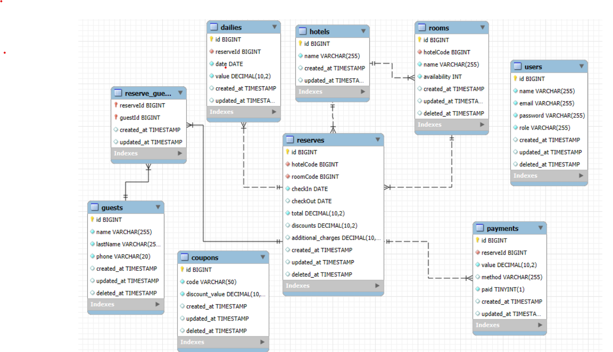

# Sistema de Gerenciamento Hoteleiro

## 📋 Sobre o Projeto

Este projeto é um sistema de gerenciamento hoteleiro que oferece um conjunto de módulos para facilitar a administração de estabelecimentos hoteleiros. **É importante destacar que o sistema foi desenvolvido com base na modelagem do banco de dados; assim, busquei implementar todas as funcionalidades evidenciadas pelo modelo, incluindo várias que não foram solicitadas no desafio.

**O histórico completo de commits está disponível na branch master do repositório.**

**Recomendo fortemente a leitura completa desse README para uma compreensão de todas as funcionalidades e configurações para o projeto**


## 🚀 Tecnologias Utilizadas

- PHP 8.1+
- Laravel Framework
- MySQL
- Docker
- Swagger
- Laravel 11
- Sanctum

## 🏆 Diferenciais Atendidos

### 📐 Padrões de Projeto
- MVC com a adição da camada de Form Request para validação de dados de entrada.
  
### 🐳 Docker
- Utilização de containers Docker para simplificar a instalação e execução do ambiente de desenvolvimento.

### 🌳 Git Pattern
- O projeto segue o padrão de branch **Git Flow**.
- Utilização de mensagens de commit.
- **O histórico de commits completo está disponível na branch (`Master`) do repositório.**

### 📡 HTTP Verbs
- Utilização apropriada de verbos HTTP (GET, POST, PUT, DELETE) para garantir a semântica correta nas requisições e operações.

### 🔒 Segurança
- Autenticação via Laravel Sanctum
- Validação de dados em todas as requisições
- Middleware de autorização por função

### 🏨 Sistema de Reservas

- - O sistema considera cupons de desconto e acréscimos, como juros e taxas de serviço.

### 📅 Disponibilidade de Reservas
- A lógica de disponibilidade foi projetada para considerar a quantidade específica de tipos de quartos. Por exemplo, quartos `Standard` com 10 unidades disponíveis são gerenciados adequadamente para evitar overbooking.

### 🧑‍💼 Gerência do Hoteleiro
- O sistema permite a gestão completa pelo hoteleiro, que pode monitorar, gerenciar e ajustar reservas, pagamentos e disponibilidade de quartos.

### 🏢 Estabelecimento com Usuários e Permissões
- O projeto possui uma estrutura de gerenciamento de usuários com permissões específicas para garantir um controle preciso de acesso e operações, de acordo com as funções dos usuários (admin, receptionist).

### 💳 Gestão de Pagamentos
- Implementação de funcionalidades para a gestão de pagamentos.

### 📝 Logs de Aplicação
- A aplicação registra logs de erro para facilitar a auditoria e o diagnóstico de problemas.

### 📚 Documentação da API
A documentação completa da API está disponível através do Swagger/ Para acessá-la, após iniciar o servidor, visite:
```bash
http://seu-caminho/public/api/documentation
```


## 💡 Funcionalidades por Nível de Acesso

### Admin
- Acesso completo ao sistema
- Gerenciamento de hotéis
- Gerenciamento de usuários
- Todas as funcionalidades do Recepcionista

### Recepcionista
- Gerenciamento de cupons e promoções
- Gerenciamento completo de reservas
- Gerenciamento de diárias
- Cadastro e gestão de hóspedes
- Gerenciamento de pagamentos
- Gerenciamento de quartos
- Associação de hóspedes às reservas

## 🗄️ Modelo do Banco de Dados

### Estrutura Principal


Você pode baixar também o .SQL [aqui](./Arquivos/db_hotel.sql)


O sistema possui rotas REST para todas as entidades do banco de dados, permitindo operações CRUD em:
- Usuários
- Quartos 
- Reservas
- Pagamentos
- Clientes
- Cupons e Juros
- Autenticação


## 📦 Pré-requisitos

- Docker e Docker Compose
- Git

## ⚙️ Instalação e Configuração

1. Clone o repositório:
```bash
https://github.com/ItaloSixx/API_HOTEL_LARAVEL
```

2. Construa a imagem Docker:
```bash
docker build -t php_app /caminho/da/Imagen/api_hotel
```

3. Inicie os containers:
```bash
docker-compose up -d
```

4. Acesse o container e execute os seguintes comandos:
```bash
composer install
php artisan migrate
php artisan import:xml
```

5. Para parar os containers:
```bash
docker-compose down
```

**Nota:** O arquivo .env foi incluído no projeto para simplificar a configuração, já que o docker-compose.yml contém todas as variáveis de ambiente necessárias para facilitar o processo de instalação. **No entanto, é essencial ajustar os caminhos dos volumes conforme necessário.**

# Informações gerais sobre o projeto

Durante o desenvolvimento deste projeto, notei um comportamento inesperado com as rotas. Após realizar testes em diferentes máquinas, descobri que era necessário incluir `/public` antes de todas as rotas para que elas funcionassem corretamente. Por exemplo:

- **Antes**: `/api/login`
- **Agora**: `/public/api/login`

Portanto, se a forma convencional (sem o `/public`) não funcionar, por favor, adicione `/public` ao início das rotas.

## Importação Automática de Dados XML via CRON

O processo de importação de dados XML é configurado para ser executado automaticamente diariamente via CRON. Esse agendamento diário permite que os dados sejam importados de forma automatizada, sem a necessidade de intervenção manual.

### Configuração do CRON

Para configurar o CRON no servidor onde a aplicação está hospedada, siga os passos abaixo:

1. **Acessar o Servidor**  
   Conecte-se ao servidor onde a aplicação está hospedada.

2. **Abrir o CRONTAB**  
   No terminal, digite o seguinte comando para abrir o editor de tarefas agendadas do sistema:

   ```bash
   sudo crontab -e

3. **Adicionar a Tarefa de Agendamento**  
   No final do arquivo aberto, adicione a linha de comando abaixo para configurar o CRON para chamar o script de importação a cada 5 minutos. Para agendar a execução diária, ajuste a frequência conforme necessário:

   ```bash
   */5 * * * * cd /caminho-para-seu-projeto && php artisan schedule:run >> /dev/null 2>&1


## ⚙️ Configuração do Ambiente

### Download do Arquivo de Rotas
Você pode baixar o arquivo de rotas clicando [aqui](./Arquivos/api_hotel.postman_collection.json) e o ambiente [aqui](./Arquivos/Caminho.postman_environment.json). Execute as rotas utilizando o Postman ou o Insomnia.

### Configuração das Variáveis de Ambiente
Certifique-se de atualizar as variáveis de ambiente para refletir o caminho e a porta corretos do seu container Docker.

## 📝 Cadastro de Usuário
Crie um usuário com papel de `admin` ou `receptionist`.

## 🔑 Login e Token
Realize o login e copie o token de autenticação gerado. Em seguida, inclua o token nas variáveis de ambiente para autenticação.


### Rotas Públicas
```bash
POST /api/login           # Autenticação de usuários
POST /api/users          # Registro de novos usuários
```

### Rotas Autenticadas (Admin e Recepcionista)
```bash
# Gerenciamento de Cupons
GET     /api/coupons
POST    /api/coupons
GET     /api/coupons/{id}
PUT     /api/coupons/{id}
DELETE  /api/coupons/{id}

# Gerenciamento de Reservas
GET     /api/reserves
POST    /api/reserves
GET     /api/reserves/{id}
PUT     /api/reserves/{id}
DELETE  /api/reserves/{id}

# Gerenciamento de Diárias
GET     /api/dailies
POST    /api/dailies
GET     /api/dailies/{id}
PUT     /api/dailies/{id}
DELETE  /api/dailies/{id}

# Gerenciamento de Hóspedes
GET     /api/guests
POST    /api/guests
GET     /api/guests/{id}
PUT     /api/guests/{id}
DELETE  /api/guests/{id}

# Gerenciamento de Pagamentos
GET     /api/payments
POST    /api/payments
GET     /api/payments/{id}
PUT     /api/payments/{id}
DELETE  /api/payments/{id}

# Gerenciamento de Quartos
GET     /api/rooms
POST    /api/rooms
GET     /api/rooms/{id}
PUT     /api/rooms/{id}
DELETE  /api/rooms/{id}

# Relacionamento Reservas-Hóspedes
POST    /api/reserves/{reserveId}/addGuest
GET     /api/reserves/{reserveId}/getGuest
GET     /api/reserves/{guestId}/getReserve
DELETE  /api/reserves/{reserveId}/{guestId}/rmvGuest
```

### Rotas Exclusivas para Admin
```bash
# Gerenciamento de Hotéis
GET     /api/hotels
POST    /api/hotels
GET     /api/hotels/{id}
PUT     /api/hotels/{id}
DELETE  /api/hotels/{id}

# Gerenciamento de Usuários
GET     /api/users
GET     /api/users/{id}
PUT     /api/users/update/{id}
PATCH   /api/users/update/{id}
DELETE  /api/users/{id}
```

### Rota de Logout
```bash
POST    /api/logout      # Requer autenticação
```

Agradeço a oportunidade de realizar o teste! 🙏. Qualquer duvida, por favor, entre em contato comigo pelo email italojefer55@gmail.com ou redes sociais


